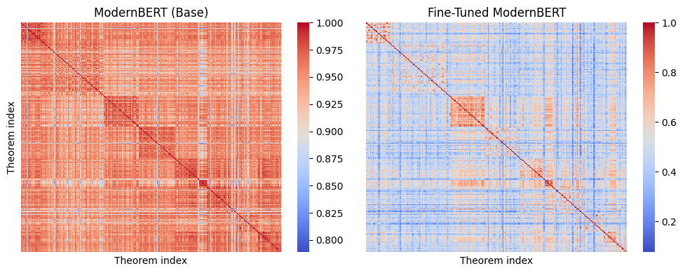

# Fine-Tuning ModernBERT for Mathematical Document Retrieval

This repository contains the code, data samples, and experiments developed as part of the Master’s thesis at the Barcelona School of Economics. The project explores how domain-specific fine-tuning of sentence embedding models can significantly enhance retrieval performance in Retrieval-Augmented Generation (RAG) systems, particularly for mathematical texts written in LaTeX.

We build a full pipeline that extracts structured math content (theorems, lemmas, definitions) from arXiv papers, generates synthetic queries using a large language model, and fine-tunes various ModernBERT variants using contrastive learning techniques. All experiments are designed to be reproducible in Google Colab, and models are loaded from and saved to private Hugging Face spaces.

---
## Authors
- Pol Garcia (pol.garcia@bse.eu)
- Natalia Lavrova (natalia.lavrova@bse.eu)
- Alex Malo (alex.malo@bse.eu)

##  Key Features

- **Contrastive Fine-Tuning**: Using Multiple Negatives Ranking Loss (MNRL), we train different versions of modernBERT to produce high-quality embeddings for retrieval.
- **Synthetic Query Generation**: We generate ~89,000 natural language questions using LLaMA 3.2 Instruct based on mathematical statements extracted from papers.
-  **Domain-Adaptive Pretraining (DAPT)**: We adapt the model to mathematical language using Masked Language Modeling on LaTeX-formatted arXiv papers.
- **Embedding Evaluation**: Performance is assessed with standard IR metrics (Accuracy@k, Recall@k, Precision@k, nDCG, MRR), showing significant improvements post fine-tuning.

---

##  Dataset Description

The dataset is derived from 12,000 mathematical research papers on arXiv (January–March 2025), scraped and parsed in their original LaTeX source format. From each paper, we extract formal mathematical statements (e.g., theorems, lemmas, definitions) using custom preprocessing techniques. Each extracted statement is paired with a synthetically generated question to form a (query, positive passage) training pair.

- Total pairs: **88,775**
- Total papers: **4,843**
- Median statements per paper: **13**
- Available in this repo: **a small sample of the dataset for inspection purposes**

---
##  Main Results

We evaluated retrieval performance using standard metrics across four model configurations: a baseline ModernBERT model, two fine-tuned versions (with and without Domain-Adaptive Pretraining), and a pre-finetuned sentence encoder from nomic.ai. All fine-tuning was performed using Multiple Negatives Ranking Loss on 88k+ question–statement pairs.

###  Retrieval Metrics

| Metric         | Baseline Model | FT ModernBERT | FT DAPT        | FT NomicAI     |
|----------------|----------------|----------------|----------------|----------------|
| Accuracy@1     | 0.1777         | 0.8655         | 0.8686         | **0.9129**     |
| Accuracy@3     | 0.2147         | 0.9150         | 0.9186         | **0.9455**     |
| Accuracy@5     | 0.2350         | 0.9282         | 0.9330         | **0.9544**     |
| Recall@30      | 0.0260         | 0.1904         | 0.1944         | **0.2204**     |
| Precision@3    | 0.1064         | 0.6053         | 0.6121         | **0.6632**     |
| Precision@5    | 0.0793         | 0.4863         | 0.4932         | **0.5432**     |
| Precision@10   | 0.0511         | 0.3406         | 0.3476         | **0.3731**     |
| nDCG@10        | 0.0733         | 0.4428         | 0.4491         | **0.4952**     |
| MRR@10         | 0.2016         | 0.8932         | 0.8966         | **0.9311**     |

Fine-tuning led to massive gains across all models and metrics. Furthermore, applying DAPT or using the sentence embeddings fine tuned nomicAI achieves further improvements, ultimately leading to more robust and accurate retrieval performance. 

---

### Cosine Similarity of Theorem Embeddings

We also analyzed how fine-tuning reshapes the semantic space. Below is a comparison of cosine similarity matrices between theorem embeddings:



The base ModernBERT produces highly uniform similarity (left), where unrelated theorems often appear close. After fine-tuning (right), the model forms more structured and discriminative clusters, separating semantically distinct mathematical content. This reflects a significant improvement in embedding quality and domain awareness.


##  How to Navigate the Repository

```bash
.
├── 1. DAPT
│   ├── DAPT_modernBERT.ipynb 
├── 2. Data
│   ├── Data_Extraction_and_Preprocessing.ipynb 
│   └── dataset_sample.csv
├── 3. Fine-Tuning
│   ├── FT_modernBERT_base.ipynb
│   ├── FT_nomic_modernBERT.ipynb
│   ├── FT_template.ipynb
│   ├── embedding_clustering.ipynb
│   ├── hard_negative_mining.ipynb
│   └── train_test_split.ipynb
├── 4. Model_Comparison
│   ├── Visualizations.ipynb
│   └── mathBERT_modernBERT.ipynb
├── 5. Query_Creation
│   ├── Dataset_manipulation.ipynb
│   ├── Post_Processing.ipynb
│   └── Query_Generation.ipynb
├── LICENSE
├── README.md
├── Thesis_Report.pdf
└── cos_sim.png

```

